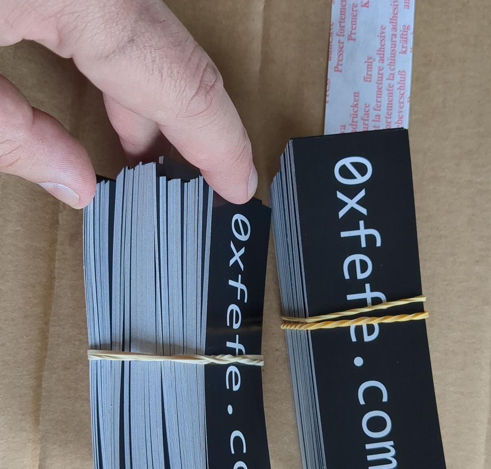
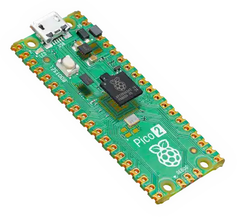
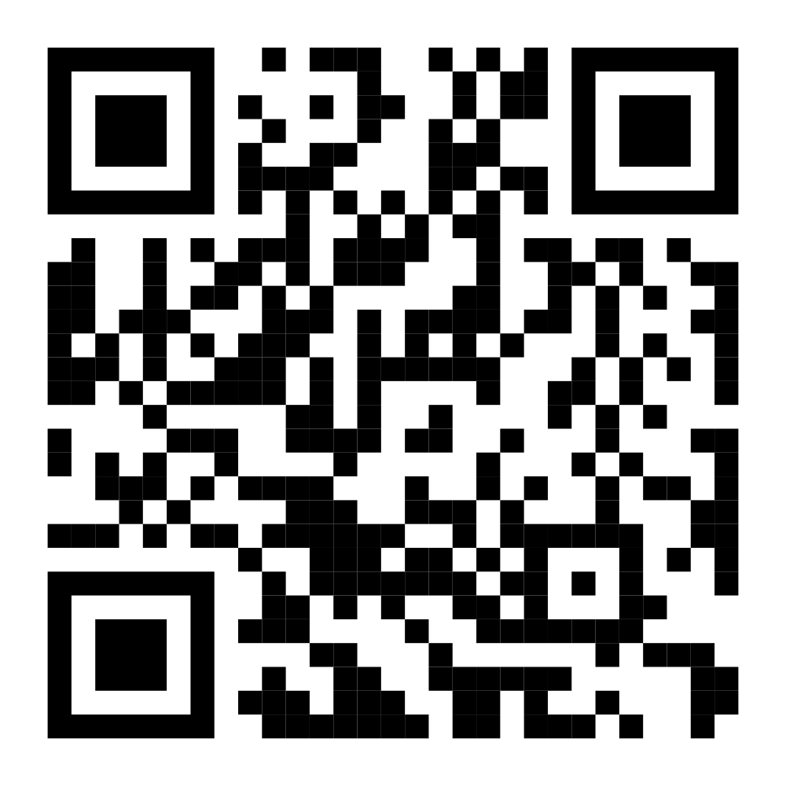
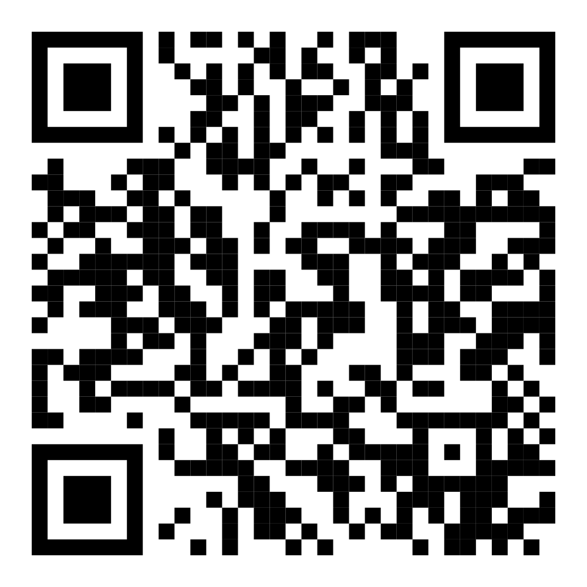

## 0xfefe_0002 

::: {.incremental}

- We are hosted again by our friends of Wolbodo!
- Drinks are friendly priced and available at the bar!
- Snacks are scattered around the room!
    - Feel free to bring your own food!
- We have 9 amazing 15 minute presentations!
- And that's not all...

:::

## We got stickers!

:::: {.columns}

::: {.column width="60%"}

:::

::: {.column .incremental width="40%"}
- 250 pieces!
- For free!
- Thanks to the attendees of 0xfefe_0001!
:::

::::

## We made a CTF!

:::: {.columns}

::: {.column width="60%"}

:::

::: {.column .incremental width="40%"}
- Built for the Raspberry Pi Pico2!
- Flash it to your own Pico2!
- <small>(At your own risk)</small>
- It uses secure boot and everything!
:::

::::

## 

:::{.r-stack}
[0xfefe.com/0002/ctf](https://0xfefe.com/0002/ctf)
:::

## 

:::{.r-stack}
[0xfefe.com/donate](https://0xfefe.com/0002/donate)
:::

